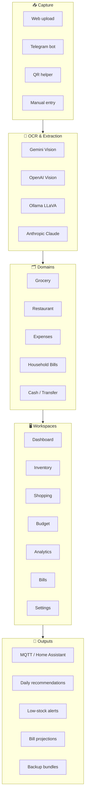
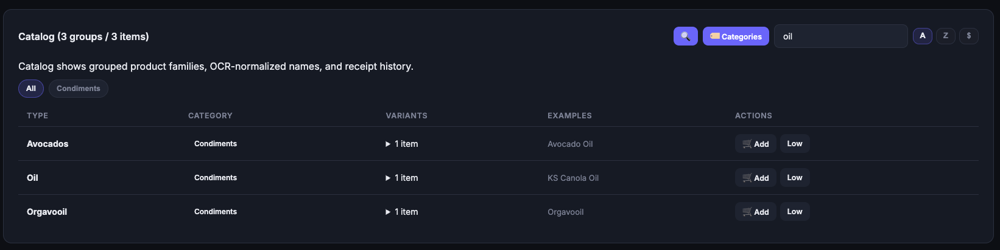
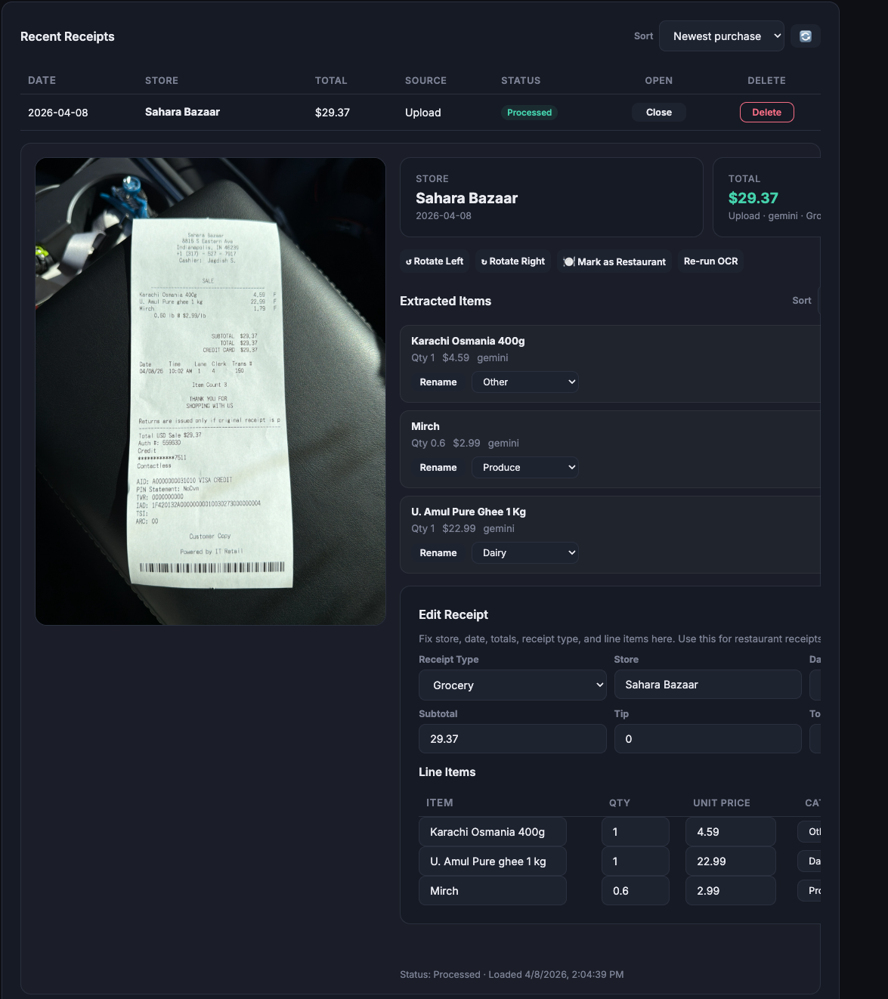
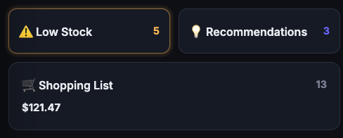
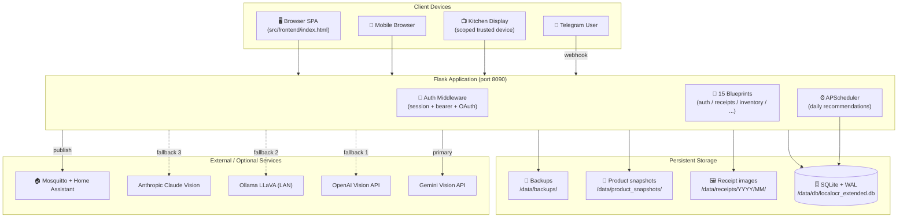
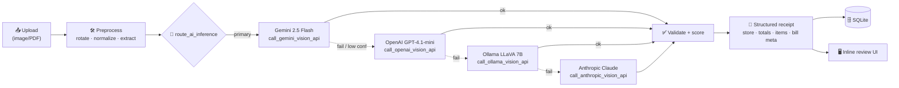
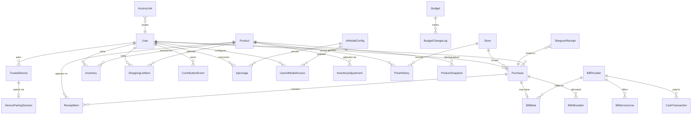
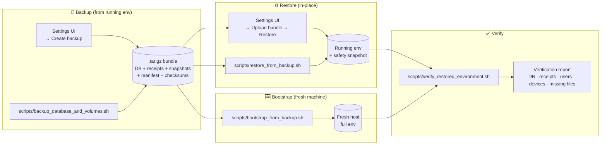

# LocalOCR Extended

A **privacy-first, self-hosted household operations platform** that turns grocery, restaurant, and bill receipts into a living inventory, shopping, budgeting, and analytics system — powered by a multi-model OCR pipeline (Gemini → OpenAI → Ollama → Anthropic) and designed to run on your own hardware.

> Capture a receipt. Get clean line items. Watch inventory update. Let recommendations drive your next shopping trip. Track every dollar across grocery, dining, expenses, and recurring bills — without ever sending your data to a third-party SaaS.

**Runs on:** Python 3.11 · Flask 3.1 · SQLAlchemy 2.0 · SQLite (WAL) · Vanilla-JS SPA · Docker Compose · Optional MQTT / Home Assistant / Telegram

---

## Table of Contents

1. [At a Glance](#at-a-glance)
2. [Screenshots](#screenshots)
3. [Feature Catalog](#feature-catalog)
4. [Workspaces Tour](#workspaces-tour)
5. [Architecture](#architecture)
6. [OCR Pipeline](#ocr-pipeline)
7. [Data Model](#data-model)
8. [Project Structure](#project-structure)
9. [Backend Module Map](#backend-module-map)
10. [API Surface](#api-surface)
11. [Frontend Architecture](#frontend-architecture)
12. [Quick Start](#quick-start)
13. [Configuration](#configuration)
14. [Operations — Backup, Restore, Bootstrap](#operations--backup-restore-bootstrap)
15. [Integrations Setup](#integrations-setup)
16. [Development Guide](#development-guide)
17. [Documentation Index](#documentation-index)
18. [Recent UI/UX Phases](#recent-uiux-phases)
19. [License](#license)

---

## At a Glance



| Metric | Value |
|---|---:|
| Backend Python modules | **39** |
| Backend lines of code | **~16,400** |
| Frontend SPA (single file) | **~28,800 lines** |
| Flask blueprints | **15** |
| Database tables | **25** |
| Alembic migrations | tracked in `alembic/versions/` |
| OCR providers (fallback chain) | **4** |
| Supported domains | grocery · restaurant · expenses · bills · cash |
| Default port | **8090** |
| Target deployment | Docker Compose (ARM64 + x86_64) |

---

## Screenshots

### 🛒 Products & Catalog Cleanup
Catalog search, OCR-normalized product families, rename support, and household product cleanup.


### 🧾 Receipts & OCR Review
Inline receipt review with image preview, extracted items, and correction tools.


### 📱 Mobile Dashboard
Compact mobile dashboard cards for low stock, top picks, and shopping awareness.


---

## Feature Catalog

### 📥 Receipt Intake & OCR

| Capability | Detail |
|---|---|
| Upload formats | JPG, PNG, HEIC, PDF (via `poppler-utils`) |
| Intent routing | Auto · Grocery · Restaurant · General Expense · Household Bill |
| OCR engines | Gemini 2.5 Flash → OpenAI GPT-4.1-mini → Ollama LLaVA → Claude Vision |
| Preprocessing | Auto-rotate, landscape→portrait normalization, PDF-to-image |
| Difficult-photo handling | Rotated-candidate comparison (0° / 90° / 180° / 270°) for hard phone photos |
| Inline correction | Store · date/time · subtotal · tax · tip · total · line items · units · size labels |
| Purchase vs refund | Flag receipt as Purchase or Refund with reason + note; refund-aware rollups everywhere |
| Safe re-run | Re-run OCR without losing manual corrections or source image |
| Receipt rotation | Left / right rotate + persist |
| Image integrity | Original image never overwritten; legacy path remapping supported |
| Manual entry | Create entries when the receipt image is lost or unavailable |

### 📦 Inventory & Catalog

| Capability | Detail |
|---|---|
| Active inventory | Per-household current stock by product + location |
| Product normalization | Rename, recategorize, and **group** OCR-garbled product families into clean catalog items |
| Default metadata | Each product carries default unit + size label for downstream shopping clarity |
| Adjustment audit | Every inventory change is logged to `InventoryAdjustment` |
| Low-stock thresholds | Per-product thresholds fire alerts and populate shopping recommendations |
| Receipt traceability | Every inventory entry traces back to a receipt line |
| Grouped rows | Household duplicates collapse into a summed quantity with location breakdown |

### 🛍️ Shopping Execution

| Capability | Detail |
|---|---|
| States | `Open` · `Bought` · `Out of Stock` |
| Add paths | Quick-find, manual add, recommendation confirm, low-stock auto-suggest |
| Grouping | Rows grouped by store for in-aisle efficiency |
| Inline edits | Store · unit · size label · price · quantity — all editable mid-trip |
| Photo capture | Snap photos from shopping rows; inline thumbnails after upload |
| Swipe-right bought | Mobile swipe-to-mark-bought with undo toast |
| QR helper | Scan-to-open a shared shopping session on a second device |
| Display names | Buyer-friendly display name with original OCR name kept as context |

### 💰 Budgeting & Allocations

| Capability | Detail |
|---|---|
| Domains | Grocery · Restaurant · Expenses · **Household Obligations** |
| Target granularity | Monthly targets per budget category |
| Line-level allocation | Each receipt line can override the receipt-level budget category |
| Refund-aware rollups | Every spend rollup subtracts refunds across domains and analytics |
| Change history | Admin-only target changes recorded in `BudgetChangeLog` |
| Contributing receipts | Drill into any category to see every receipt that contributed |
| Recurring categories | utilities · housing · insurance · childcare · subscriptions · health · other recurring |

### 🏠 Bills & Recurring Obligations

| Capability | Detail |
|---|---|
| Bill metadata | Provider, provider type, billing cycle, service period, due date, cadence, recurring flag |
| Canonical providers | `BillProvider` normalizes names to prevent fragmentation (e.g. "PG&E" vs "Pacific Gas") |
| Service lines | `BillServiceLine` models multiple services under one provider (e.g. combined gas + electric) |
| Cadence support | Monthly · Bimonthly · Quarterly · Semiannual · Annual |
| Planning cards | Per-month recurring-obligation cards with Expected / Entered / Outstanding states |
| Projections | Bill projection estimates from prior history |
| Drill-down | Bills workspace opens matching receipt history without collapsing older receipts |

### 🍽️ Restaurant / 💼 Expenses / 💵 Cash

| Capability | Detail |
|---|---|
| Restaurant | Exact menu line items, dining budget card, top items, top restaurants, repeat-order estimates, visit counts |
| Expenses | One-off spend (services, gifts, fees, retail) with categories (Beauty · Gift · Fees · Service · Health · Retail) |
| Cash / Transfer | Log personal-service payments (tutor, therapist, cleaner) without a receipt — flows into bills and budgets |

### 📊 Analytics & Reporting

| Capability | Detail |
|---|---|
| Spending analytics | Monthly totals + category breakdown across every domain |
| Price history | Per-product price timeline across stores |
| Deals captured | Surface best price-per-unit observations |
| Store comparison | Side-by-side store pricing for recurring items |
| Utility summaries | Provider totals, trends, and cadence awareness |
| Bill projections | Forward-looking estimates of upcoming recurring obligations |
| Contribution scoring | Household contribution ledger with ways-to-help suggestions |

### 👥 Collaboration & Devices

| Capability | Detail |
|---|---|
| Roles | Admin · User · Read-only |
| Login | Email/password · Google OAuth 2.0 (optional) · Bearer token (integrations) |
| Trusted devices | QR pairing flow with device scopes: `Shared Household` · `Kitchen Display` · `Read Only` |
| Device management | Rename · rescope · revoke · last-seen timestamps · duplicate consolidation |
| Guest demo | Read-only demo experience with seeded sample data for non-logged-in visitors |
| Write-access guard | Read-only devices blocked at backend middleware, not just hidden in UI |

### 🔄 Backup & Portability

| Capability | Detail |
|---|---|
| Full environment backup | DB + receipt images + product snapshots + config |
| Manifest + checksums | Every backup bundle has a fingerprint and verification report |
| UI flow | Create · verify · upload · download · restore — all from Settings |
| Fresh-machine bootstrap | `bootstrap_from_backup.sh` stands up a new host from a single `.tar.gz` |
| Safety backup | Auto-snapshot before restore so nothing is irreversibly lost |
| Timestamps | Displayed in local timezone in UI |

### 🔌 Integrations

| Integration | What it does |
|---|---|
| **Telegram bot** | Forward a receipt photo to your bot → webhook ingests it → routes to correct user by chat linkage |
| **MQTT + Home Assistant** | Publishes inventory changes, low-stock alerts, recommendations, budget alerts; HA auto-discovery supported |
| **Google OAuth** | Invite-based login flow for household members |
| **Ollama** | Local LLaVA endpoint for offline/private OCR (runs on LAN or `host.docker.internal`) |

---

## Workspaces Tour

| Workspace | Primary purpose | Highlights |
|---|---|---|
| **Dashboard** | At-a-glance household state | Ranking scorecards · grocery status · QR access · long-press reveals |
| **Inventory** | Current stock & locations | Search-first layout · shared toggle with Products · per-location breakdown |
| **Products** | Catalog cleanup | Rename · group OCR families · set defaults · admin snapshot review queue |
| **Upload Receipt** | Intake & OCR | Intent selector · image preview · restaurant-specific hints · re-run OCR |
| **Receipts** | Browse & correct | Filters · inline detail · refund toggle · drill-in from Bills |
| **Shopping List** | Active shopping trip | Store grouping · inline edit · swipe-bought · QR helper · photo capture |
| **Budget** | Targets & rollups | Category cards · contributing receipts · change history · Household Obligations panel |
| **Bills** | Recurring obligations | Per-month planning cards · provider summaries · cadence awareness |
| **Restaurant** | Dining tracking | Top items · visit counts · ticket averages · exact menu lines |
| **Expenses** | One-off spend | Merchant history · category breakdown · refund-aware |
| **Analytics** | Spending trends | Cross-domain rollups · price history · store comparison |
| **Contribution** | Household scoring | Ledger · recent activity · ways-to-help prompts |
| **Settings** | Admin & config | Users · catalog review · backup/restore · trusted devices · AI model selection |

---

## Architecture



### Component responsibilities

- **Flask application (`create_flask_application.py`)** — composes the 15 blueprints, wires auth middleware, registers error handlers, resolves configuration secrets, and serves the single-file SPA from `/`.
- **SQLAlchemy + Alembic (`initialize_database_schema.py` + `alembic/`)** — declarative models for 25 tables; migrations auto-run on backend startup.
- **APScheduler (`schedule_daily_recommendations.py`)** — daily 8 AM recommendation job and threshold-check timers.
- **MQTT publisher (`publish_mqtt_events.py` + `setup_mqtt_connection.py`)** — retained messages for inventory / budget / recommendation topics with Home Assistant auto-discovery.
- **OCR router (`route_ai_inference.py` + `extract_receipt_data.py`)** — selects the first healthy model, runs extraction, falls back on failure or low confidence.
- **Frontend SPA (`src/frontend/index.html`)** — single HTML file embedding CSS + JS; client-side routing; Fetch-based transport.

---

## OCR Pipeline



### OCR model matrix

| Model | Role | Module | Env var(s) | Notes |
|---|---|---|---|---|
| **Gemini 2.5 Flash** | Primary | `call_gemini_vision_api.py` | `GEMINI_API_KEY` · `GEMINI_MODEL` | Fast · accurate · cheap · supports restaurant hints & rotated-candidate comparison |
| **OpenAI GPT-4.1-mini** | Fallback 1 | `call_openai_vision_api.py` | `OPENAI_API_KEY` · `OPENAI_OCR_MODEL` | Reliable · strong structured-output prompting |
| **Ollama LLaVA 7B** | Fallback 2 | `call_ollama_vision_api.py` | `OLLAMA_ENDPOINT` · `OLLAMA_MODEL` · `OLLAMA_TIMEOUT_SECONDS` | **Offline / private**; runs on LAN or `host.docker.internal` |
| **Anthropic Claude Vision** | Fallback 3 | `call_anthropic_vision_api.py` | (admin-registered) | Deep reasoning for truly ambiguous receipts |

Extra OCR features:

- **Restaurant-specific prompting** — menu-item hints improve line extraction on difficult phone photos.
- **Rotated-candidate comparison** — tries 0°/90°/180°/270° and picks the highest-confidence parse.
- **Junk-row filtering** — rejects Ollama template-echo responses that would otherwise poison line items.
- **Admin model registry** (`manage_ai_models.py`) — admins register models and control per-user access via unlock codes; usage is tracked in `ApiUsage`.

---

## Data Model



### Tables grouped by concern

| Group | Tables |
|---|---|
| **Identity & access** | `User` · `TrustedDevice` · `DevicePairingSession` · `AccessLink` |
| **Catalog** | `Product` · `Store` |
| **Inventory** | `Inventory` · `InventoryAdjustment` |
| **Receipts** | `Purchase` · `ReceiptItem` · `PriceHistory` |
| **Bills & cash** | `BillMeta` · `BillProvider` · `BillServiceLine` · `BillAllocation` · `CashTransaction` |
| **Budget** | `Budget` · `BudgetChangeLog` |
| **Shopping & snapshots** | `ShoppingListItem` · `ProductSnapshot` |
| **Contribution** | `ContributionEvent` |
| **Integrations** | `TelegramReceipt` |
| **AI models** | `AIModelConfig` · `UserAIModelAccess` · `ApiUsage` |

All 25 tables are defined in `src/backend/initialize_database_schema.py`.

---

## Project Structure

```
LocalOCR_Extended/
├── src/
│   ├── backend/                              # 39 Python modules (~16.4k LOC)
│   │   ├── create_flask_application.py       # 🚀 Entrypoint — composes blueprints
│   │   ├── initialize_database_schema.py     # 🗄️ All 25 SQLAlchemy models
│   │   ├── handle_receipt_upload.py          # receipts_bp — upload, reprocess, rotate
│   │   ├── manage_authentication.py          # auth_bp — login, OAuth, device pairing
│   │   ├── manage_inventory.py               # inventory_bp — stock + low-stock
│   │   ├── manage_shopping_list.py           # shopping_list_bp — list + swipe-bought
│   │   ├── manage_product_catalog.py         # products_bp — catalog cleanup
│   │   ├── manage_product_snapshots.py       # product_snapshots_bp — photo review queue
│   │   ├── manage_household_budget.py        # budget_bp — targets + rollups
│   │   ├── manage_cash_transactions.py       # cash_transactions_bp — tutor/therapy/etc.
│   │   ├── manage_contributions.py           # contributions_bp — ledger + scoring
│   │   ├── manage_environment_ops.py         # environment_ops_bp — backup/restore
│   │   ├── manage_ai_models.py               # ai_models_bp + admin_ai_models_bp
│   │   ├── calculate_spending_analytics.py   # analytics_bp — cross-domain reports
│   │   ├── generate_recommendations.py       # recommendations_bp — seasonal + low-stock
│   │   ├── extract_receipt_data.py           # 🤖 OCR orchestration + validation
│   │   ├── route_ai_inference.py             # Routes to healthy model, handles fallback
│   │   ├── call_gemini_vision_api.py         # Primary OCR
│   │   ├── call_openai_vision_api.py         # Fallback 1
│   │   ├── call_ollama_vision_api.py         # Fallback 2 (local/private)
│   │   ├── call_anthropic_vision_api.py      # Fallback 3
│   │   ├── save_receipt_images.py            # Receipt image persistence + remapping
│   │   ├── active_inventory.py               # Inventory derivation helpers
│   │   ├── check_inventory_thresholds.py     # Low-stock detection
│   │   ├── bill_cadence.py                   # Cadence-aware matching
│   │   ├── bill_planning.py                  # Recurring-obligation planning cards
│   │   ├── generate_bill_projections.py      # Forward-looking bill estimates
│   │   ├── budgeting_domains.py              # Grocery/Restaurant/Expenses/Bills routing
│   │   ├── budgeting_rollups.py              # Refund-aware spend rollups
│   │   ├── contribution_scores.py            # Household contribution scoring
│   │   ├── enrich_product_names.py           # Buyer-friendly display names
│   │   ├── normalize_product_names.py        # OCR family grouping
│   │   ├── normalize_store_names.py          # Merchant normalization
│   │   ├── schedule_daily_recommendations.py # APScheduler jobs (8 AM)
│   │   ├── setup_mqtt_connection.py          # Mosquitto client setup
│   │   ├── publish_mqtt_events.py            # Retained-message publishing + HA discovery
│   │   ├── configure_telegram_webhook.py     # Bot registration
│   │   └── handle_telegram_messages.py       # telegram_bp — webhook ingestion
│   └── frontend/
│       └── index.html                        # 📱 SPA (~28.8k lines: HTML + CSS + JS)
│
├── alembic/                                  # Schema migrations
│   ├── versions/                             # Ordered migration files
│   └── env.py
├── alembic.ini
│
├── data/                                     # Runtime volumes (Docker-mounted)
│   ├── db/                                   # SQLite DB + WAL + SHM
│   ├── receipts/YYYY/MM/                     # Receipt images by year/month
│   ├── product_snapshots/                    # Supporting item photos (UUID-keyed)
│   └── backups/                              # Backup bundles (.tar.gz)
│
├── scripts/                                  # Operational scripts
│   ├── backup_database_and_volumes.sh        # Manual env backup
│   ├── restore_from_backup.sh                # Restore into running env
│   ├── bootstrap_from_backup.sh              # Fresh-machine bootstrap
│   └── verify_restored_environment.sh        # Post-restore verification report
│
├── config/
│   └── mosquitto/mosquitto.conf              # Optional local MQTT broker config
│
├── docs/                                     # Deep-dive documentation
│   ├── ARCHITECTURE.md                       # System design & data flow
│   ├── API_REFERENCE.md                      # REST endpoint reference
│   ├── APP_SETUP_GUIDE.md                    # Install & first-run
│   ├── DEPLOYMENT_GUIDE.md                   # Production deployment
│   ├── BACKUP_RESTORE_RUNBOOK.md             # Backup procedures
│   ├── COMPLETE_PRODUCT_SPEC.md              # Full feature specification
│   ├── IMPLEMENTATION_STATUS.md              # Feature status tracker
│   ├── NGINX_PROXY_MANAGER_SETUP.md          # Reverse-proxy recipe
│   ├── multi-model-selection-architecture.md # OCR model selection deep-dive
│   ├── LocalOCR Extended plan.md             # Architecture & planning
│   └── images/readme/                        # 3 screenshots used by this README
│
├── future enhancements/                      # Long-term planning notes
├── tests/                                    # Test suite
│
├── docker-compose.yml                        # Backend + optional MQTT + Ollama
├── Dockerfile                                # python:3.11-slim + poppler-utils
├── requirements.txt                          # Python dependencies
├── .env.example                              # Env template (safe to commit)
│
├── README.md                                 # 👈 This file
├── PRD.md                                    # Product requirements doc
├── PROMPT.md                                 # Prompt engineering notes
├── CONTINUITY.md                             # Development continuity
└── UI_UX_ENHANCEMENT_PLAN.md                 # Active UX phase plan
```

---

## Backend Module Map

### Core + composition
| Module | Purpose |
|---|---|
| `create_flask_application.py` | App factory · blueprint registration · middleware · static hosting |
| `initialize_database_schema.py` | All 25 SQLAlchemy models · schema definition |

### Blueprint modules
| Module | Blueprint | Prefix |
|---|---|---|
| `manage_authentication.py` | `auth_bp` | `/auth` |
| `handle_receipt_upload.py` | `receipts_bp` | `/receipts` |
| `manage_product_catalog.py` | `products_bp` | `/products` |
| `manage_product_snapshots.py` | `product_snapshots_bp` | `/product-snapshots` |
| `manage_inventory.py` | `inventory_bp` | `/inventory` |
| `manage_shopping_list.py` | `shopping_list_bp` | `/shopping-list` |
| `manage_household_budget.py` | `budget_bp` | `/budget` |
| `manage_cash_transactions.py` | `cash_transactions_bp` | `/cash-transactions` |
| `manage_contributions.py` | `contributions_bp` | `/contributions` |
| `calculate_spending_analytics.py` | `analytics_bp` | `/analytics` |
| `generate_recommendations.py` | `recommendations_bp` | `/recommendations` |
| `manage_environment_ops.py` | `environment_ops_bp` | `/system` |
| `manage_ai_models.py` | `ai_models_bp` · `admin_ai_models_bp` | `/api/models` · `/api/admin/models` |
| `handle_telegram_messages.py` | `telegram_bp` | `/telegram` |

### OCR / vision
| Module | Purpose |
|---|---|
| `extract_receipt_data.py` | OCR orchestration · validation · confidence scoring |
| `route_ai_inference.py` | Model selection · fallback chain · health checks |
| `call_gemini_vision_api.py` | Google Gemini vision client |
| `call_openai_vision_api.py` | OpenAI vision client |
| `call_ollama_vision_api.py` | Ollama LLaVA client |
| `call_anthropic_vision_api.py` | Anthropic Claude vision client |
| `save_receipt_images.py` | Image persistence · rotation · legacy-path remapping |

### Domain helpers
| Module | Purpose |
|---|---|
| `active_inventory.py` | Inventory derivation from receipts + adjustments |
| `check_inventory_thresholds.py` | Low-stock detection |
| `bill_cadence.py` | Cadence-aware matching (monthly … annual) |
| `bill_planning.py` | Recurring-obligation planning cards |
| `generate_bill_projections.py` | Forward-looking bill estimates |
| `budgeting_domains.py` | Domain routing (grocery/restaurant/expense/bill) |
| `budgeting_rollups.py` | Refund-aware spend rollups |
| `contribution_scores.py` | Household contribution scoring |
| `enrich_product_names.py` | Buyer-friendly display names |
| `normalize_product_names.py` | OCR family grouping |
| `normalize_store_names.py` | Merchant normalization |

### Infrastructure
| Module | Purpose |
|---|---|
| `schedule_daily_recommendations.py` | APScheduler jobs (daily recs at 8 AM) |
| `setup_mqtt_connection.py` | Mosquitto client bootstrap |
| `publish_mqtt_events.py` | Retained-message publishing + HA auto-discovery |
| `configure_telegram_webhook.py` | Bot registration helper |

---

## API Surface

All endpoints require authentication unless noted. Read-only devices are blocked on write endpoints at middleware level.

| Blueprint | Prefix | What it does |
|---|---|---|
| `auth_bp` | `/auth` | Login · logout · Google OAuth callback · QR pairing · trusted devices · password reset · app-config |
| `receipts_bp` | `/receipts` | Upload · detail · reprocess · approve · rotate · filter · refund flag · bill lookups |
| `products_bp` | `/products` | Catalog CRUD · search · rename · recategorize · group |
| `product_snapshots_bp` | `/product-snapshots` | Photo upload · serve · list · admin review queue |
| `inventory_bp` | `/inventory` | Inventory CRUD · low-stock · location · shopping actions |
| `shopping_list_bp` | `/shopping-list` | List CRUD · recommendation confirm · swipe-bought · state transitions |
| `budget_bp` | `/budget` | Targets · rollups · category breakdowns · Household Obligations |
| `cash_transactions_bp` | `/cash-transactions` | Personal-service payments (tutor, therapy, cleaner) |
| `contributions_bp` | `/contributions` | Scoring · events · ledger |
| `analytics_bp` | `/analytics` | Spending reports · price history · deals · store comparison · projections |
| `recommendations_bp` | `/recommendations` | Seasonal + deal detection + low-stock alerts |
| `environment_ops_bp` | `/system` | Backup · restore · verify · bootstrap |
| `ai_models_bp` | `/api/models` | User model selection |
| `admin_ai_models_bp` | `/api/admin/models` | Admin model registry · usage tracking |
| `telegram_bp` | `/telegram` | Webhook ingestion (token-validated) |

See `docs/API_REFERENCE.md` for full endpoint documentation.

---

## Frontend Architecture

| Aspect | Approach |
|---|---|
| **Shape** | Single HTML file at `src/frontend/index.html` — embeds CSS + JS |
| **Framework** | None (vanilla JavaScript) |
| **Routing** | Client-side history · view-based rendering |
| **Transport** | `fetch()` for all API calls |
| **State** | `localStorage` (session token, sidebar, preferences) + `sessionStorage` (filters, transient state) |
| **Styling** | Custom-property design tokens (no CSS framework) · dark mode default |
| **Typography** | Fraunces (serif display) + Manrope (sans body) |
| **Mobile** | Bottom-sheet modals · swipe-right bought flow · magnifier search reveal · long-press ranking reveal |

### Views rendered by the SPA

Dashboard · Inventory · Products · Upload Receipt · Receipts · Shopping List · Budget · Bills · Restaurant · Expenses · Analytics · Contribution · Settings · QR Shopping Helper.

---

## Design System (Apple-inspired)

LocalOCR Extended ships with an Apple-inspired design system on the `apple-design-system` branch. Cinematic black ↔ light-gray canvas duality, SF Pro Display/Text with optical sizing, Apple Blue (`#0071e3`) as the singular chromatic accent, 980 px pill CTAs, translucent nav glass, and a single soft card shadow.

### Where the canonical values live

| Path | Role |
|---|---|
| `design/Design System inspired by Apple design.md` | Full 11-section spec — philosophy, color tokens, typography, spacing/grid, elevation, radius, components, iconography, motion, accessibility, rollout roadmap |
| `design/Design System inspired by Apple.md` | Source reference the adaptation was built against |
| `design/design-tokens.json` | Source of truth for every token (colors light+dark, shadows, typography, spacing, radius, icon sizes, motion) |
| `scripts/build_tokens.py` | Compiles the JSON into CSS custom properties |
| `src/frontend/styles/tokens.generated.css` | Committed mirror — regenerate after editing the JSON |

Rebuild after any JSON edit:

```bash
python3 scripts/build_tokens.py
# then paste the contents of src/frontend/styles/tokens.generated.css into
# the main <style> block in src/frontend/index.html.
```

### Themes

A pre-paint `<script>` in `<head>` sets `data-theme` on `<html>` from `localStorage["theme"]` or `prefers-color-scheme`. The sidebar Light/Dark toggle flips and persists.

- **Light canvas:** `#f5f5f7` cool light gray. Text `#1d1d1f`. Accent Apple Blue `#0071e3`.
- **Dark canvas:** `#000000` pure black with a `#1d1d1f → #2a2a2d` micro-tint surface ladder. Accent `#0a84ff`.

### Design Gallery

Every primitive lives at `http://localhost:8090/#gallery` (or press `g` then `g` outside a text field):

- Color swatches for ~30 `--color-*` tokens
- Buttons — primary, secondary, ghost, danger, success, tonal, pill-link, icon — sizes + states
- Cards — default, interactive, selected, flat
- Badges — semantic, confidence, category
- Inputs — default / focus / invalid / disabled / select / textarea
- Toggle switch
- Drop Zone (default / dragover / invalid / uploading)
- Scan Progress (bar + ring, all states)
- Confidence Ring (sm / md / lg across all three tiers)
- Result Card (grid)
- Floating Toolbar
- Extracted Text Panel
- Typography scale (Hero → xs)

### Keyboard shortcuts

Press `?` anywhere outside a text field for the cheat sheet. Highlights:

- `g <letter>` → jump to any page (`g d` Dashboard, `g r` Receipts, `g b` Bills, `g g` Gallery, …)
- `Esc` → close modal

### Rollout status on the branch

Phases 1 – 5 of the spec are implemented on `apple-design-system`:

- **Phase 1 — tokens + theme switcher** ✓ `design-tokens.json`, generator, pre-paint theme, legacy aliases, sidebar Light/Dark toggle.
- **Phase 2 — base components + gallery** ✓ Button, Card, Input, Badge, Toggle, Glass nav primitive.
- **Phase 3 — OCR composites** ✓ Drop Zone, Scan Progress (bar + ring), Confidence Ring, Result Card, Toolbar, Extracted Text Panel.
- **Phase 4 — page rollouts**
  - Upload view ✓ (drop-zone + inline scan-progress)
  - Receipts history ✓ (result-card grid, mobile-safe flex-wrap at ≤ 720 px)
  - Dashboard alert cards (Low Stock / Top Picks / Shopping) ✓ — harmonized to identical raised cards with only the count-number color carrying the semantic signal
  - Contribution summary stats ✓ (Apple card recipe — shadow, no border, display-font numeric)
  - Mobile sticky header ✓ — now theme-aware glass instead of hardcoded dark
  - Processing view, Results view (Extracted Text Panel wired to live OCR data) — primitives ship in the gallery; full page integration not yet done
- **Phase 5 — polish + docs** ✓ Cheat sheet + global `g <letter>` nav, `.processing-overlay` helpers, `.status-mark-paid-pop` confirm spring, empty-state primitives, this README section.

Deferred (environmentally blocked): commissioned monochrome empty-state illustrations, Lighthouse performance pass on the authenticated Results view, OCR bounding-box geometry (needs backend field).

### Writing a new component

1. Open the spec at `design/Design System inspired by Apple design.md` §7.
2. Use tokens from `design/design-tokens.json` — never hard-code a color, radius, spacing, or duration.
3. Add variants + states to the gallery at `#page-design-gallery` (inside `src/frontend/index.html`).
4. Re-run `python3 scripts/build_tokens.py` if you touched the JSON.
5. SF Pro Display ≥ 20 px, SF Pro Text < 20 px. Negative letter-spacing at every size. Apple Blue is the *only* chromatic accent.

---

## Quick Start

### Path A — Docker Compose (recommended)

```bash
git clone https://github.com/chatwithllm/LocalOCR_Extended.git
cd LocalOCR_Extended

cp .env.example .env
# Edit .env — at minimum set:
#   INITIAL_ADMIN_TOKEN, INITIAL_ADMIN_PASSWORD, SESSION_SECRET, GEMINI_API_KEY

docker compose up -d --build
# ✅ App is now running at http://localhost:8090
# Sign in with INITIAL_ADMIN_EMAIL / INITIAL_ADMIN_PASSWORD
```

### Path B — With local MQTT + Ollama (full self-hosted)

```bash
docker compose --profile local-infra up -d --build
# Adds:
#   Mosquitto MQTT broker on port 1883
#   Ollama with LLaVA on port 11434
```

### Path C — Local Python (development)

```bash
python3.11 -m venv .venv && source .venv/bin/activate
pip install -r requirements.txt

cp .env.example .env   # and edit
alembic upgrade head   # optional — also auto-runs on startup

python -m src.backend.create_flask_application
# Open http://localhost:8090
```

---

## Configuration

All configuration is read from `.env`. The file is safe to copy from `.env.example` (which ships with placeholder values). Never commit your real `.env`.

### Required

| Variable | Purpose |
|---|---|
| `INITIAL_ADMIN_TOKEN` | Bearer token for integrations & API access (generate with `python -c "import secrets; print(secrets.token_urlsafe(32))"`) |
| `INITIAL_ADMIN_EMAIL` | First admin login email |
| `INITIAL_ADMIN_PASSWORD` | First admin login password |
| `INITIAL_ADMIN_NAME` | Display name for the initial admin |
| `SESSION_SECRET` | Flask session signing secret (generate like the token) |
| `FERNET_SECRET_KEY` | Encrypts admin-stored API keys + future external credentials (generate once, see [Encrypted Credentials](#encrypted-credentials-fernet_secret_key) below) |
| `GEMINI_API_KEY` | Primary OCR provider key (only required if you use the env-mode Gemini setup; if you store the key via Settings → AI Models with `stored_key` mode, this can be empty) |
| `GEMINI_MODEL` | Gemini model (default: `gemini-2.5-flash`) |

### Optional OCR fallbacks

| Variable | Default | Purpose |
|---|---|---|
| `OPENAI_API_KEY` | _(empty)_ | Enable OpenAI vision fallback |
| `OPENAI_OCR_MODEL` | `gpt-4.1-mini` | OpenAI model name |
| `OLLAMA_ENDPOINT` | `http://host.docker.internal:11434` | Ollama LAN URL |
| `OLLAMA_MODEL` | `llava:7b` | Ollama model |
| `OLLAMA_TIMEOUT_SECONDS` | `180` | Generous timeout for slow local inference |

### Runtime

| Variable | Default |
|---|---|
| `FLASK_ENV` | `production` |
| `FLASK_PORT` | `8090` |
| `FLASK_DEBUG` | `0` |
| `SESSION_COOKIE_SECURE` | `0` (set `1` behind HTTPS) |
| `APP_SERVICE_NAME` | `localocr-extended-backend` |
| `APP_DISPLAY_NAME` | `LocalOCR Extended` |
| `APP_SLUG` | `localocr_extended` |
| `DATABASE_URL` | `sqlite:////data/db/localocr_extended.db` |
| `RECEIPTS_DIR` | `/data/receipts` |
| `BACKUP_DIR` | `/data/backups` |
| `BACKUP_PREFIX` | `localocr_extended` |
| `RECOMMENDATION_TIME` | `08:00` |
| `RECEIPT_RETENTION_MONTHS` | `12` |

### MQTT / Home Assistant

| Variable | Default |
|---|---|
| `MQTT_BROKER` | `host.docker.internal` |
| `MQTT_PORT` | `1883` |
| `MQTT_USERNAME` · `MQTT_PASSWORD` | _(empty — anon broker)_ |
| `MQTT_CLIENT_ID` | `localocr-extended` |
| `MQTT_TOPIC_PREFIX` | `home/localocr_extended` |
| `MQTT_DISCOVERY_ENABLED` | `true` |
| `HOME_ASSISTANT_DISCOVERY_PREFIX` | `homeassistant` |
| `HOME_ASSISTANT_BASE_URL` | `http://homeassistant.local:8123` |
| `HOME_ASSISTANT_DASHBOARD_PATH` | `/lovelace/localocr-extended` |

### Telegram

| Variable | Notes |
|---|---|
| `TELEGRAM_BOT_TOKEN` | From @BotFather |
| `TELEGRAM_WEBHOOK_BASE_URL` | Must be **public HTTPS** |
| `TELEGRAM_WEBHOOK_SECRET` | Random string shared with Telegram |

### Encrypted credentials (`FERNET_SECRET_KEY`)

The app stores some sensitive values in the database (e.g. user-supplied AI provider API keys, Plaid access tokens on the `plaid-api-integration` branch). These are encrypted at rest using the [`cryptography.fernet.Fernet`](https://cryptography.io/en/latest/fernet/) symmetric cipher. The key is read from the `FERNET_SECRET_KEY` environment variable at startup.

#### Generate the key

You need the Python `cryptography` library to generate a key. Pick whichever path matches your setup.

##### Easiest: use the running container (works on any OS)

The container already has `cryptography` installed. From any host with Docker:

```bash
docker exec localocr-extended-backend \
    python3 -c "from cryptography.fernet import Fernet; print(Fernet.generate_key().decode())"
```

This prints a 44-character base64-url-safe key like `xK3Qm9Lp8WnRtV2YuB5fH7jKzAxNcDeEgF1iJoMqRsU=`. Copy it into your `.env`:

```
FERNET_SECRET_KEY=xK3Qm9Lp8WnRtV2YuB5fH7jKzAxNcDeEgF1iJoMqRsU=
```

Then restart so the new env var loads:

```bash
docker compose up -d --force-recreate backend
```

##### Generating from your host (per OS)

If you'd rather generate without going through the container — for example, if you're setting up `.env` before the first `docker compose up` — install `cryptography` locally and run the same one-liner.

**macOS** (Python 3 ships with the OS; `pip3` works out of the box):

```bash
pip3 install --user cryptography
python3 -c "from cryptography.fernet import Fernet; print(Fernet.generate_key().decode())"
```

If you use Homebrew Python (`brew install python`), the command is identical. If you hit `error: externally-managed-environment` on newer macOS Pythons, prefer a virtualenv:

```bash
python3 -m venv /tmp/fernet && source /tmp/fernet/bin/activate
pip install cryptography
python3 -c "from cryptography.fernet import Fernet; print(Fernet.generate_key().decode())"
deactivate
```

**Linux — Debian / Ubuntu:**

```bash
sudo apt install -y python3-cryptography
python3 -c "from cryptography.fernet import Fernet; print(Fernet.generate_key().decode())"
```

Or with pip in a venv:

```bash
sudo apt install -y python3-venv
python3 -m venv /tmp/fernet && source /tmp/fernet/bin/activate
pip install cryptography
python3 -c "from cryptography.fernet import Fernet; print(Fernet.generate_key().decode())"
deactivate
```

**Linux — Fedora / RHEL / Rocky / Alma:**

```bash
sudo dnf install -y python3-cryptography
python3 -c "from cryptography.fernet import Fernet; print(Fernet.generate_key().decode())"
```

**Linux — Arch:**

```bash
sudo pacman -S python-cryptography
python -c "from cryptography.fernet import Fernet; print(Fernet.generate_key().decode())"
```

**Windows (PowerShell or cmd, with Python from [python.org](https://www.python.org/downloads/) or the Microsoft Store):**

```powershell
pip install cryptography
python -c "from cryptography.fernet import Fernet; print(Fernet.generate_key().decode())"
```

In **Windows Subsystem for Linux (WSL)**, follow the matching Linux distro instructions.

**No Python at all and don't want to install one?** Use the container approach above — it's a single `docker exec` and works identically on every OS.

#### Verify it loaded

```bash
docker exec localocr-extended-backend printenv FERNET_SECRET_KEY
```

Should print the key. If it prints nothing, the env var didn't load — make sure you used `docker compose up -d --force-recreate backend` and not just `docker restart`, since `docker restart` keeps the original env.

#### What the key encrypts

| Column | Table | When |
|---|---|---|
| `api_key_encrypted` | `ai_model_configs` | When you save an AI provider key in Settings → AI Models with **Credential Mode = Stored Key** |
| `access_token_encrypted` | `plaid_items` | When you connect a bank via Plaid Link (only on the `plaid-api-integration` branch) |

Receipts, purchases, products, users, bills, and budgets are **plaintext** — only secrets that need to round-trip through the app are encrypted.

#### Dev vs prod — separate keys

Use a **different key per environment** (dev, staging, prod). Standard 12-factor practice — a leaked dev key shouldn't give an attacker access to prod-stored secrets. The keys are cheap to generate; no reason to share one.

```
.env (dev)    FERNET_SECRET_KEY=<dev-key>
.env (prod)   FERNET_SECRET_KEY=<prod-key>     # different from dev
```

#### Backup and restore behavior

The backup script tarballs the SQLite DB + `/data/receipts`. It does **not** include `.env`, so the Fernet key never leaves the host.

| Restore scenario | What happens |
|---|---|
| Restore dev backup → dev (same key) | ✅ Everything works, encrypted secrets decrypt fine |
| Restore prod backup → prod (same key) | ✅ Same |
| Copy prod backup → dev (different keys) | ⚠️ Receipts/purchases/products/users restore fine. Encrypted columns become unreadable — re-enter the API keys / re-link Plaid in dev. (Safer this way: prod credentials stay in prod.) |

#### Rotation

**Generate once, then never change it.** Rotating the key invalidates every encrypted column already stored. If you must rotate (e.g. compromise), the procedure is:

1. Decrypt all encrypted columns with the old key
2. Set `FERNET_SECRET_KEY` to the new key
3. Re-encrypt and persist with the new key

There's no built-in rotation tool — at the volumes this app handles, manually re-entering 1-2 API keys via the admin UI is faster than building one.

#### Storage

Treat `FERNET_SECRET_KEY` like a password — keep it in your password manager, secrets manager, or deployment config. Never commit `.env`. If you lose the prod key with no backup, you'll need to re-enter every encrypted credential in the app.

---

## Operations — Backup, Restore, Bootstrap



| Script | When to use |
|---|---|
| `scripts/backup_database_and_volumes.sh` | Manual backup outside the UI (cron-friendly) |
| `scripts/restore_from_backup.sh` | Restore a bundle into an already-running env |
| `scripts/bootstrap_from_backup.sh` | Stand up a brand-new host from a single bundle |
| `scripts/verify_restored_environment.sh` | Post-restore integrity check |

**Safety:** The restore flow automatically creates a safety snapshot before overwriting anything — nothing irreversible happens by default.

See `docs/BACKUP_RESTORE_RUNBOOK.md` for the step-by-step runbook.

---

## Integrations Setup

### Telegram Bot

1. Talk to `@BotFather` → create a bot → save the token.
2. Set `TELEGRAM_BOT_TOKEN` in `.env`.
3. Set `TELEGRAM_WEBHOOK_BASE_URL` to your **public HTTPS** origin (e.g. behind nginx-proxy-manager).
4. Set `TELEGRAM_WEBHOOK_SECRET` to a random string.
5. Restart the backend — `configure_telegram_webhook.py` registers the webhook on boot.
6. Link your Telegram user in **Settings → Integrations**.

### MQTT + Home Assistant

1. Point `MQTT_BROKER` at your existing broker, or run the bundled Mosquitto with `--profile local-infra`.
2. Leave `MQTT_DISCOVERY_ENABLED=true` for auto-discovery.
3. HA will auto-populate entities under the `homeassistant/` discovery prefix.
4. Published topics live under `home/localocr_extended/…` by default.

### Google OAuth (optional)

1. Create OAuth credentials at [console.cloud.google.com/apis/credentials](https://console.cloud.google.com/apis/credentials).
2. Set `GOOGLE_CLIENT_ID`, `GOOGLE_CLIENT_SECRET`, `OAUTH_REDIRECT_BASE_URL` in `.env`.
3. Set `GOOGLE_OAUTH_ENABLED=true` (or false to disable even with creds present).
4. Invite household members from **Settings → Users** — they'll see a Google sign-in button.

### Ollama (local/private OCR)

1. Run Ollama on the same host or elsewhere on your LAN: `ollama serve`.
2. Pull the model: `ollama pull llava:7b`.
3. Set `OLLAMA_ENDPOINT` to the reachable URL (default `http://host.docker.internal:11434` works from Docker on macOS/Windows).

### Proactive product image backfill

A nightly job (04:00 daily) fetches a matching image for any `Product` that
has no `ProductSnapshot` yet, so kitchen tiles + shopping rows show real
imagery instead of category-emoji fallbacks.

Providers (tried in order, first success wins):
1. Wikimedia (always tried, no API key required, courtesy User-Agent sent).
2. Unsplash — set `UNSPLASH_ACCESS_KEY` to enable.
   Signup: <https://unsplash.com/oauth/applications>.
3. Pexels — set `PEXELS_API_KEY` to enable.
   Signup: <https://www.pexels.com/api/>.

Behaviour:
- Up to 50 products processed per run; 7-day retry cooldown for products
  no provider could match.
- Auto-fetched snapshots tagged `source_context="auto_fetch"`,
  `status="auto"`, so they appear immediately on tiles AND surface in the
  existing review queue at `/product-snapshots/review-queue` for admin
  oversight (relink / dismiss bad matches).
- Images normalized to 600 px wide JPEG (≤ 1 MB) before persistence.

Manual one-off trigger:

```bash
docker compose exec backend python -c \
  "from src.backend.schedule_daily_recommendations import _run_image_backfill; _run_image_backfill()"
```

---

## Development Guide

### Running tests

```bash
source .venv/bin/activate
pytest tests/
```

### Adding a new API blueprint

1. Create `src/backend/manage_<feature>.py`.
2. Define a blueprint: `my_bp = Blueprint("my_feature", __name__, url_prefix="/my-feature")`.
3. Register it in `create_flask_application.py` (the `register_blueprints` section).
4. Add `@require_auth` and, for writes, `@require_write_access` decorators.

### Adding a new database table

1. Add the `class MyThing(Base)` definition to `initialize_database_schema.py`.
2. Generate a migration: `alembic revision --autogenerate -m "add my_thing"`.
3. Review the generated SQL in `alembic/versions/`.
4. Migrations auto-run on next backend startup.

### Adding a new OCR model

1. Create `src/backend/call_<provider>_vision_api.py` following the interface of `call_gemini_vision_api.py`.
2. Add the provider to the fallback chain in `route_ai_inference.py`.
3. Register the model in `manage_ai_models.py` so admins can enable it per-user.
4. Add env vars for keys/endpoints and document them in `.env.example` and this README.

### Editing the frontend

The entire SPA is in `src/frontend/index.html`. It's served statically by Flask at `/`. There's no build step — edit, save, refresh. Design tokens live in the `:root` CSS block near the top of the file.

---

## Documentation Index

| File | Audience | Summary |
|---|---|---|
| [`docs/ARCHITECTURE.md`](docs/ARCHITECTURE.md) | Developers | System design, data flow, module responsibilities |
| [`docs/API_REFERENCE.md`](docs/API_REFERENCE.md) | Developers / integrators | Full REST endpoint catalog |
| [`docs/COMPLETE_PRODUCT_SPEC.md`](docs/COMPLETE_PRODUCT_SPEC.md) | Product / contributors | Complete feature specification |
| [`docs/IMPLEMENTATION_STATUS.md`](docs/IMPLEMENTATION_STATUS.md) | Contributors | Feature status tracker |
| [`docs/APP_SETUP_GUIDE.md`](docs/APP_SETUP_GUIDE.md) | Self-hosters | First-run & configuration |
| [`docs/DEPLOYMENT_GUIDE.md`](docs/DEPLOYMENT_GUIDE.md) | Operators | Production deployment patterns |
| [`docs/BACKUP_RESTORE_RUNBOOK.md`](docs/BACKUP_RESTORE_RUNBOOK.md) | Operators | Backup/restore runbook |
| [`docs/NGINX_PROXY_MANAGER_SETUP.md`](docs/NGINX_PROXY_MANAGER_SETUP.md) | Self-hosters | Reverse-proxy + HTTPS recipe |
| [`docs/multi-model-selection-architecture.md`](docs/multi-model-selection-architecture.md) | Developers | OCR model selection deep-dive |
| [`docs/LocalOCR Extended plan.md`](docs/LocalOCR%20Extended%20plan.md) | Product | Architecture & planning notes |
| `PRD.md` | Product | Product requirements |
| `UI_UX_ENHANCEMENT_PLAN.md` | Design / frontend | Active UX phase plan |
| `CONTINUITY.md` | Contributors | Development continuity notes |

---

## Recent UI/UX Phases

| Phase | Branch | Highlights |
|---|---|---|
| **Phase 1-4** | `ui-ux-enhancement` | Design tokens, component polish, micro-interactions, mobile experience |
| **Phase 5** | `apple-design-system` | Apple HIG-inspired design system — SF Pro, Apple Blue, cinematic canvas duality, 5-phase rollout (merged PR #3) |
| **Phase 6** | `mobile-cosmetic-polish` | Full mobile polish pass — compact headers, iOS-style row lists, chip grids with 3D-Touch peek, bill auto-pay + due-date accrual rollup, non-destructive Re-run OCR, failed-receipt auto-cleanup (merged PR #4) |
| **Phase 7** | `ai-model-credential-ux-fix` · `bulk-receipt-upload` · `receipt-filename-index` | AI key UX fix, bulk receipt upload with per-row inline progress + Stop, human-readable receipt filename index for SSH lookup + Content-Disposition downloads (merged PRs #5, #6, #7) |

### Phase 6 Highlights (mobile-cosmetic-polish)

**Bill & Payment Workflow:**
Bill dates separated into Statement / Due / Paid with auto-pay toggle, backend sweep, and accrual rollup by due-date month. Multi-service utility bills categorize correctly. OCR prompt expanded for due-date synonyms and auto-pay detection. Re-run OCR is non-destructive on failure. Failed receipts auto-prune on next successful upload.

**Shared Components:**
`.summary-row-list` (unified tappable list), `.month-chip` with `data-quick-action` long-press peek, `renderCompactReceiptRows()` with configurable click handler, `formatPrettyDate()` for consistent "Apr 14, 2026" dates across all views.

**Per-Page Polish:**
Every page (Dashboard, Receipts, Upload, Restaurant, Expenses, Shopping, Budget, Bills, Inventory) received mobile-specific compaction: compact headers (82 to 48px), 2-column filter grids, iOS-style receipt/store/merchant row lists, tighter stat cards, inline refresh buttons, and consistent micro-cap label styling.

### Phase 7 Highlights

**AI model credential UX fix (PR #5):**
The admin form silently dropped pasted API keys when Credential Mode was left at the default `env`. Now typing into the API key field auto-promotes the dropdown to `Stored Key` and shows a green confirmation hint. Backend safety net auto-promotes the same way for any older client payload. The `FERNET_SECRET_KEY missing` error now returns an actionable 400 with the generation command instead of a cryptic 500. Update conflicts on `(provider, model_string)` return a clean 409 with the conflicting row id.

**Bulk receipt upload (PR #6):**
The upload page now accepts any number of files at once (drag-drop or multi-select). Each file appears as a row in a batch list with its own checkbox, status badge, and per-file progress bar. Sequential processing: each row turns Processing → ✓ Done with extracted store + total OR ✕ Failed with retry button.
- **Inline detail panel** auto-expands on the active row showing live OCR result with line items, confidence, model used, and an Open in Receipts button. Auto-collapses as the next file starts.
- **Stop button** (red, appears mid-batch) aborts the in-flight fetch via `AbortController` and marks remaining queued files as ⏸ Cancelled — re-selectable for retry.
- **Per-row Retry** for failed files, deselecting all others.

**Receipt filename index (PR #7):**
Files on disk keep their stable UUID names (backups stay intact, no rename collisions). Two new affordances make them human-findable:
- **`<receipts_root>/_index.txt`** — append-only text file, one line per receipt: `relative/path.pdf  AES_Indiana_2026-04-16  2026-04-16  $87.40  purchase_id=92`. SSH-friendly: `grep`, `tail`, `less` all work.
- **Content-Disposition on downloads** — clicking a receipt's image in the UI saves it to disk as `AES_Indiana_2026-04-16.pdf` instead of the UUID filename.
- **Regen script** at `scripts/rebuild_receipt_index.py` walks the DB and rewrites the index after backup restores or mass cleanup.

---

## License

See the project repository for license details. The project is designed for household and personal self-hosted use; no data leaves your environment except for explicit calls to configured cloud OCR providers (which you control via `.env`).

---

**Questions? Issues?** Open a ticket in the repository, or consult the deeper documents in [`docs/`](docs/).
